<div align="center">

# Novel Agent

**检索与上下文编译器驱动的长篇小说运行时**

世界模型 · 叙事模型 · 规划 · 写作 · 语义审校 · 有界自动推进


[特性](#-特性) · [架构](#-架构总览) · [快速开始](#-快速开始) · [长跑写作](#-长跑写作与导出) · [Web 工作台](#-web-工作台) · [文档](#-文档)

</div>

---

Novel Agent 是一个面向长篇小说的 AI 创作运行时:以**世界模型 + 叙事模型**双知识图谱承载设定与剧情,由**检索与上下文编译器**为规划者 / 写作者 / 审校者供给恰好够用、权限安全的信息,用**八重审校闸门**守护正典唯一真相,再以**有界自动推进**状态机实现约 8–9 分钟一章的无人值守长跑。

后端零第三方依赖(纯 Python stdlib),94 个 MCP 工具可接入 Claude / Codex / ChatGPT / 自研 Agent;V0.11 新增**导演位**——每章边界可输入人工引导指令、或让模型提案走向候选并审核修改计划后再开写。

## 🏗️ 架构总览

<div align="center">
  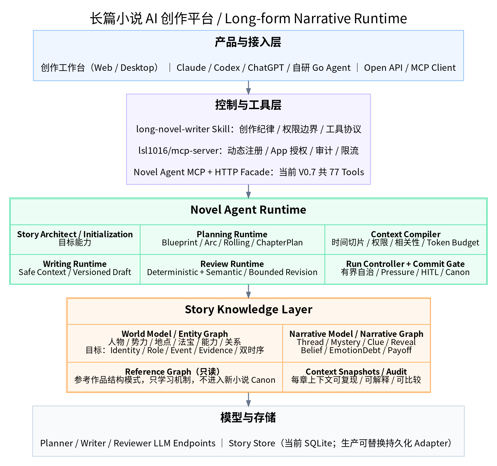
</div>

六层架构:产品与接入层(创作工作台 / 各类 Agent / MCP Client)→ 控制与工具层(创作纪律 Skill + 94 个 MCP 工具 + HTTP 门面)→ 运行时层(规划 / 写作 / 审校 / 运行控制 / 上下文编译)→ 知识层(实体图 + 叙事图双模型)→ 模型层(OpenAI / Anthropic 双协议)→ 存储层(SQLite 正典库)。

## 🧠 故事知识:世界模型 + 叙事模型

<div align="center">
  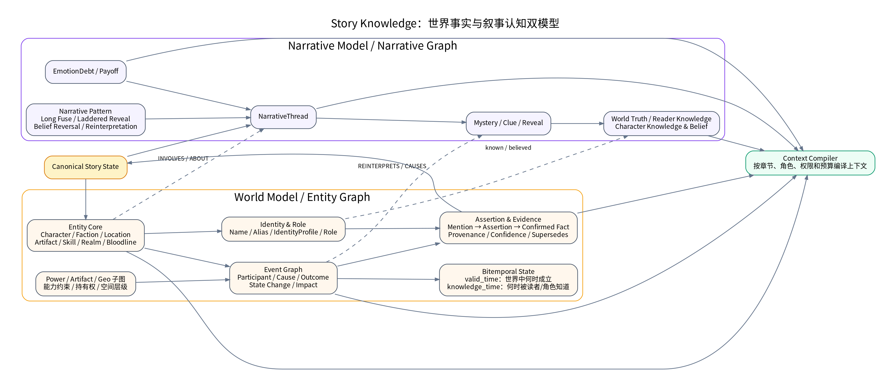
</div>

实体图回答**世界是什么**;叙事图回答**故事如何揭示它**。

```text
正典故事图
├── 实体图 / 世界模型
│   ├── 角色 / 阵营 / 地点
│   ├── 物品 / 神器 / 技能 / 境界
│   ├── 时间属性 / 时间关系
│   └── narrative_entity_links
└── 叙事图
    ├── 叙事线 / 谜团
    ├── 线索 / 伏笔 / 揭示 / 兑现
    ├── 情感债
    └── 信念状态
```

秘密别名 / 属性 / 关系可绑定到 `WorldFact + BeliefState`。`entity_author_get` 能看到作者真相;写作者的安全工具会自动过滤隐藏的世界关系。

## 🔄 单章创作闭环

<div align="center">
  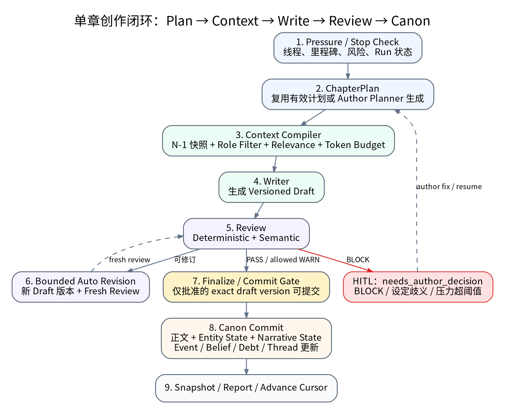
</div>

压力与停更检查 → 章节计划 → 上下文编译 → 写作 → 八重审校 → 定稿入正典;BLOCK 触发有界修订循环,重大剧情节点提请作者决策(人在回路)。

## ✨ 特性

- **🧩 双模型故事知识** — 实体图(角色 / 阵营 / 地点 / 物品 / 时序属性与关系)+ 叙事图(叙事线 / 谜团 / 伏笔 / 情感债 / 信念状态),支持身份档案、一等事件、断言与双时序披露。
- **🔍 检索与上下文编译器** — 按角色可见性隔离,确定性相关性排序 + token 预算打包(写作者默认 56k / 规划者 120k / 审校者 104k,可配);写作者拿到的安全上下文不含任何隐藏真相值,审校者另有可感知作者真相的独立快照。
- **🛡️ 八重审校闸门** — 4 个确定性审校者 + 4 个语义审校者,BLOCK 触发有界修订循环,知识泄漏零容忍。
- **🎬 导演位(人工引导)** — `steering_mode` 让每章规划前暂停:输入本章引导指令,或让模型基于当前故事状态提案 3 个走向候选(带触达线程与风险),选定/改写后生效;`plan_review` 让计划生成后可查看/修改(JSON 编辑+重新校验)再批准开写。指令在计划生成后自动销账,不污染后续章节。
- **🔁 有界自动推进** — 持久化运行状态机:断点续跑、自动重试、作者决策(HITL)与重新规划。
- **🌐 公开工作台** — 无登录、无用户权限分级，全部工作区、作者设定、草稿和操作公开可用；模型的剧情知识过滤与正典定稿校验仍保留。
- **🧰 94 个 MCP 工具 + HTTP 门面** — 兼容 OpenAI / Anthropic 双协议的任意端点,同一套配置无缝切换;后端零第三方依赖。
- **✦ 一句话开书** — `./novel.sh new "创意" 300 3` 或 Web 开书向导:四段式生成完整架构(蓝图/真相/实体/叙事/篇章)→ 跨引用确定性校验 → 有界修复回路 → 显式应用 → 自动开跑。
- **🖥️ Web 工作台(九工作区)** — 项目主页/运行中心(实时流水线+导演台+HITL)/写作工作室(纸页+定稿闸门+草稿编辑)/开书向导/世界观设定集(可缩放图谱)/叙事看板(信念矩阵+伏笔台账)/规划器(弧线甘特)/审校中心(章节×审校器矩阵)/时间线;多书管理、慢操作作业执行器,静态 SPA 与 API 同进程,运行侧零 Node 依赖。
- **📖 正典唯一真相** — 只有定稿闸门放行的章节才进入正典故事图;抽取候选必须携带证据链经 `candidate_promote` 晋升。

## 🚀 快速开始

```bash
cd mcp-server
python -m pip install -e . --no-build-isolation

novel-story init-story \
  --db ../story-data/my-novel.db \
  --title 'My Novel' \
  --main-goal '第一阶段主线目标' \
  --current-arc '开篇'

novel-story apply-architecture \
  --db ../story-data/my-novel.db \
  --file ../examples-architecture.json \
  --dry-run

novel-story apply-architecture \
  --db ../story-data/my-novel.db \
  --file ../examples-architecture.json
```

`examples-architecture.json` 已包含世界事实、实体、实体属性、实体关系、叙事↔实体链接、叙事线、谜团、情感债、篇章、里程碑与日程。

## 💡 一句话开书(Phase C)

不想手写 architecture?给一句创意,四段式架构生成器(蓝图/真相 → 实体 → 叙事 → 结构)直接展开成完整可用的 architecture.json:

```bash
# 只生成 + 确定性校验,产物落盘 story-data/<slug>/(idea/architecture/validation/stages):
PYTHONPATH=mcp-server/src python3 -m novel_mcp.cli create-from-idea \
  --db story-data/my.db \
  --idea "近未来都市悬疑:记忆质检员在被删记忆里发现同一个陌生人的求救信号,而删除指令是她自己签发的。" \
  --target-chapters 300

# 一键全链路(第三参 = 自动 apply 并长跑到第 N 章):
./novel.sh new "近未来都市悬疑:记忆质检员在被删记忆里发现同一个陌生人的求救信号。" 300 3
```

生成 ≠ 应用:默认停在 dry-run 报告;`--apply` 显式过 `story_architect_apply`(与外部手写架构同一道跨引用闸门),`--run N` 再自动开跑。生成物跨引用(entity/thread/fact/arc)、窗口包含、揭示顺序、骨架覆盖率全部确定性校验,失败自动有界修复(≤3 轮)。MCP 侧等价工具:`novel_architecture_generate`，无需角色令牌。

## ✍️ 长跑写作与导出

配置好模型端点(`env/llm.env`,见 `scripts/stress/README.md`)后,**`./novel.sh` 一个入口搞定**(start 自动断点续跑并开启思考捕获,stop 无损停止):

```bash
./novel.sh start        # 发起/续跑长跑(写到第 40 章;./novel.sh start 60 可指定)
./novel.sh watch        # 实时观察创作:阶段事件流 + 模型思考流
./novel.sh status       # 看进度:进程/章节/字数/最近章节
./novel.sh book         # 导出小说并用编辑器打开(story-data/novel/<书名>.md)
./novel.sh stop         # 无损停止(已提交章节不丢,再 start 即续跑)
./novel.sh metrics      # KPI 指标(token 增长/BLOCK 率/线程沉睡等)
./novel.sh log          # 跟随驱动日志;./novel.sh smoke 单章冒烟
```

等价的底层命令(`novel.sh start` 在库文件不存在时会自动补 `--seed` 载入种子架构;已有库直接续跑,不会重写任何已提交章节):

```bash
# 首次:载入种子架构并开跑(之后直接 ./novel.sh start 即可续跑)
python3 scripts/stress/drive.py --db story-data/stress.db --seed --auto-answer --target-chapter 40

# 随时把已提交章节导出为可读 Markdown(story-data/novel/<书名>.md):
python3 scripts/stress/export_novel.py

# 随时输出 KPI 指标(token 增长/BLOCK 率/线程沉睡等):
python3 scripts/stress/metrics.py --db story-data/stress.db
```

完整参数表、断点续跑、单章冒烟、审校意见回放等见 **`scripts/stress/README.md`**。实测约 8–9 分钟/章。

## 🖥️ Web 工作台

浏览器可视化长跑:实时流水线监视(SSE)、章节纸页阅读、定稿检查单、审校结论、实体图谱、叙事看板与时间线。同一进程提供静态 SPA + `/api/v1` 聚合读 + 动作透传(与外部 Agent 走同一闸门),后端零新增依赖:

<p align="center">
  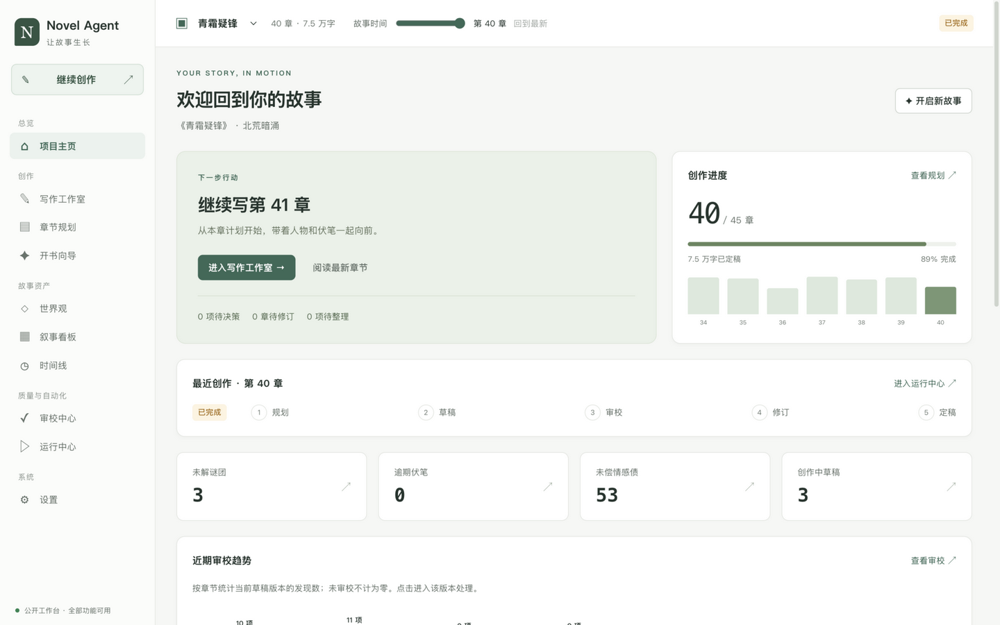
</p>

<p align="center">
  <b>写作工作室</b> — 纸页正文、本章计划、写作上下文与定稿检查单
</p>
<p align="center">
  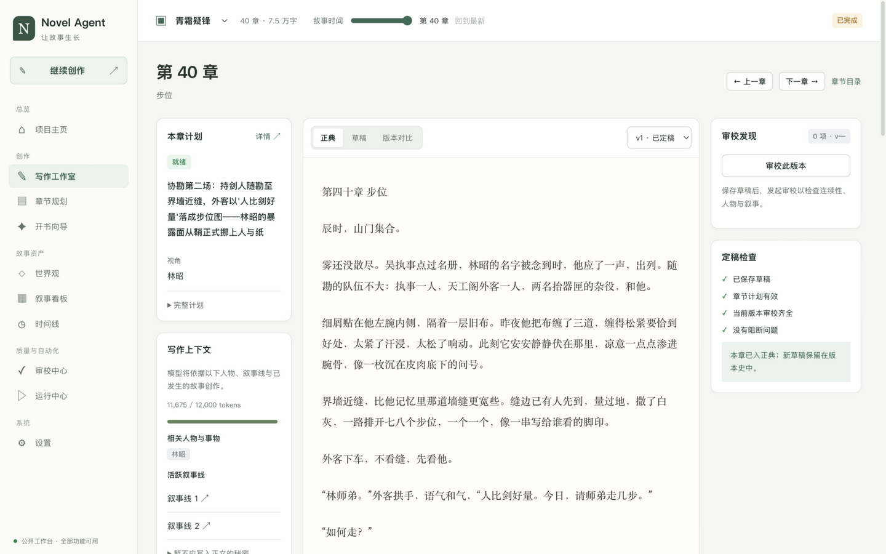
</p>

<table>
  <tr>
    <td align="center">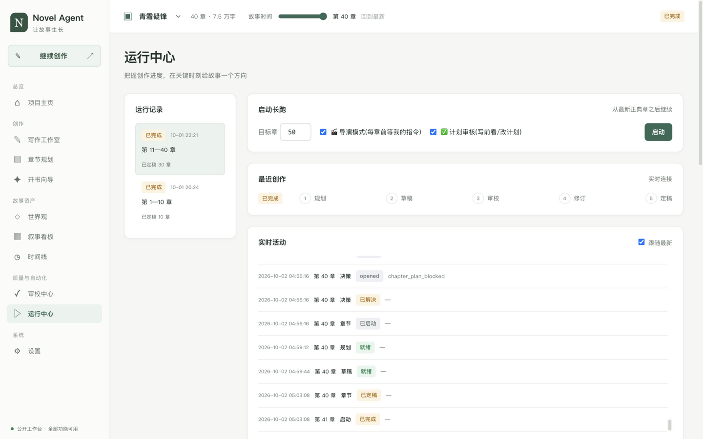<br><sub><b>运行中心</b> — 长跑启动、导演模式与实时活动流</sub></td>
    <td align="center">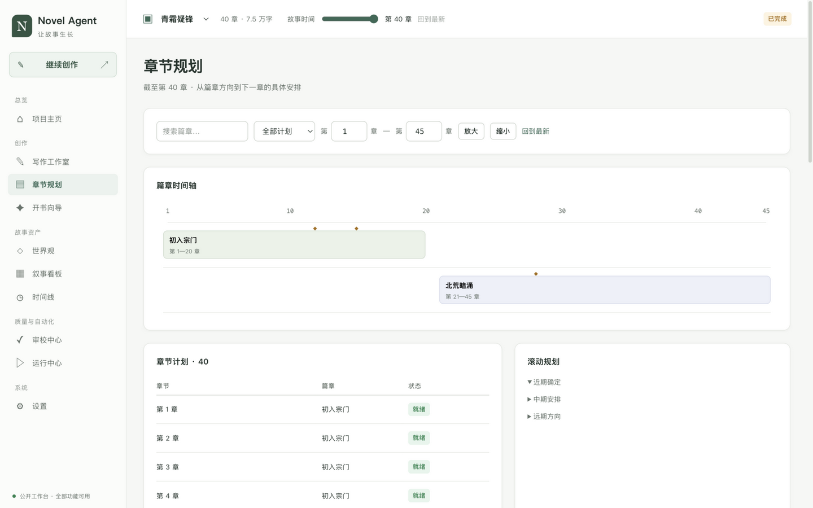<br><sub><b>章节规划</b> — 篇章时间轴与滚动规划</sub></td>
    <td align="center">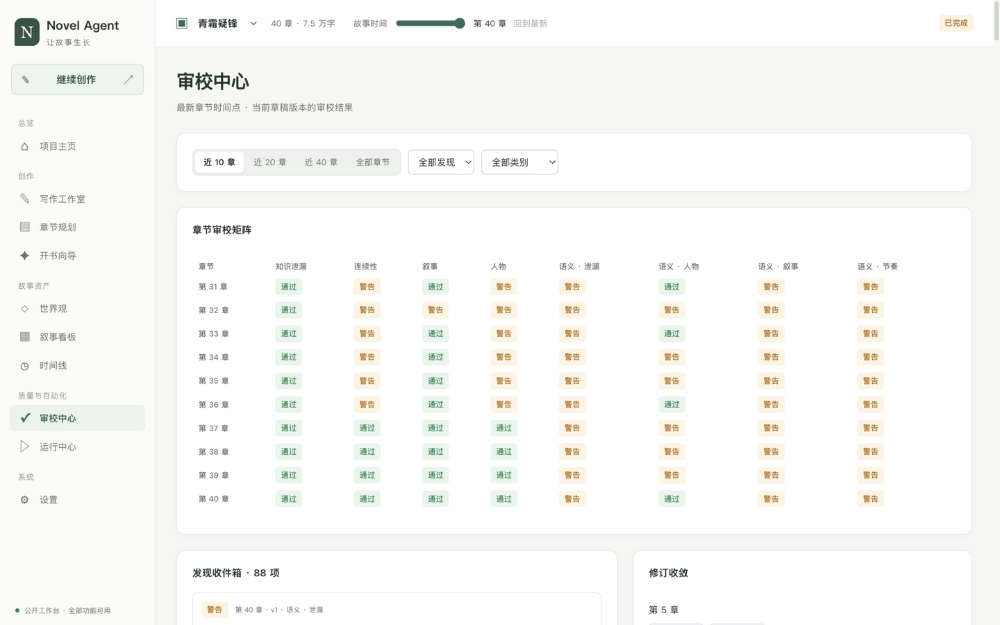<br><sub><b>审校中心</b> — 章节 × 审校器矩阵与修订收敛</sub></td>
  </tr>
  <tr>
    <td align="center">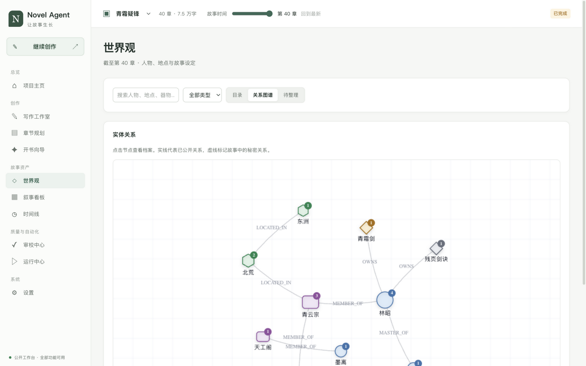<br><sub><b>世界观</b> — 实体目录与可缩放关系图谱</sub></td>
    <td align="center">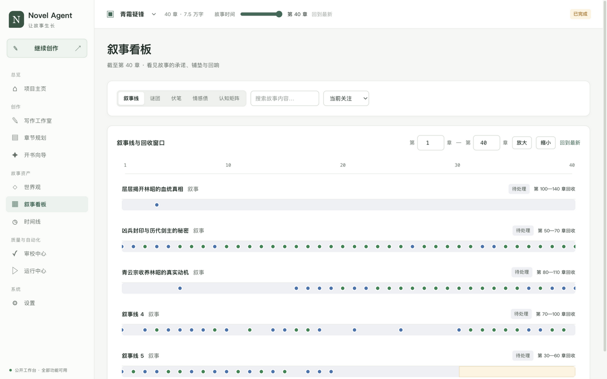<br><sub><b>叙事看板</b> — 叙事线、谜团、伏笔与情感债台账</sub></td>
    <td align="center">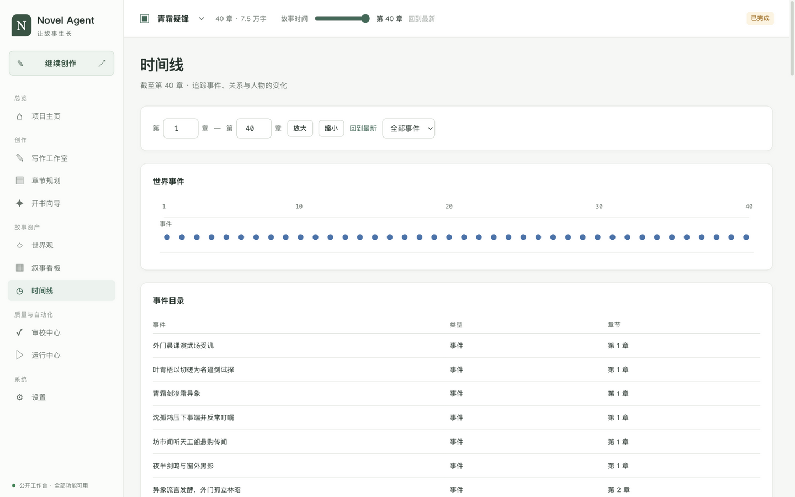<br><sub><b>时间线</b> — 世界事件与人物变化追踪</sub></td>
  </tr>
  <tr>
    <td align="center" colspan="3">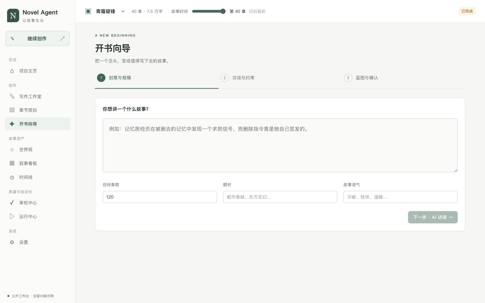<br><sub><b>开书向导</b> — 一句话创意 → AI 访谈 → 蓝图确认三步开书</sub></td>
  </tr>
</table>

```bash
# 1) 构建前端产物(一次性;运行不需要 Node)
cd frontend && npm install && npm run build && cd ..

# 2) 起工作台(指向任意故事库;建议对长跑库用备份副本)
python3 -m novel_mcp.web_api --db story-data/stress.db --static frontend/dist --port 8080
#    或等价: novel-story web --db ... --static ... --port 8080  (PYTHONPATH=mcp-server/src)

# 3) 打开 http://127.0.0.1:8080
```

开发模式:`cd frontend && npm run dev`(`:5173`,`/api` 自动代理到 `:8080`)。

公开访问：不设置登录或用户权限，旧 `NOVEL_FACADE_TOKENS` 配置不再限制访问。任何可访问服务的人均可查看作者真相、编辑和发起模型任务；公开到网络时请明确这一行为。API Key 仍不返回浏览器，业务校验与定稿闸门不受影响。

工作台交互（2026-10-03）：

- ≥1280px 完整侧栏与三栏工作室；768–1279px 图标导航；<768px 抽屉导航、列表卡片与正文优先的工作室页签。
- 首页以“下一步行动”为中心：继续写作、处理审校阻断、回答作者决策、恢复运行，数字可下钻。
- 草稿停笔 3 秒自动保存为新版本；离开或切书时保护未保存内容，保留本地恢复副本。支持精确版本审校、引用定位、双栏差异与恢复为新版本。`⌘/Ctrl+S` 保存、`⌘/Ctrl+Enter` 审校、`⌘/Ctrl+Alt+←/→` 切章。
- 书库、筛选、时间点与详情保存在 URL。切书会销毁旧书查询缓存、取消请求并关闭事件流，后台作业固定使用提交时的书库。
- 开书向导分为创意规模、AI 访谈与约束、蓝图与假设确认三步；应用前展示准确的变更预览，拒绝的假设可附替代要求重新生成。

回归验证（只使用临时数据库，AI 用离线夹具替代，不调用真实模型）：

```bash
cd mcp-server && python3 -m pytest -q
cd ../frontend && npm ci && npm run build && npm run test:e2e
# 使用系统 Chrome（macOS 默认路径），其他环境可设置 CHROME_PATH。
# 没有系统 Chrome 时，先运行 npx playwright install chromium。
```

## 🔌 Agent 接入与 MCP 网关

将 Novel Agent 的全部 **91** 个 HTTP 工具注册到 `lsl1016/mcp-server` 网关,参见:

- `docs/mcp-gateway-tool-registration.md`
- `registration/generate_mcp_server_registration.py`
- `registration/mcp-server-batch-create.json`

兼容服务器为网关流程暴露 `POST /api/agent/tools/call/{name}` 端点。双路径架构(自动长跑 vs MCP 工具路径)与三种接入用法见 `docs/agent-paths.md`。

实体图工具面速览:

```text
写作者安全读取    entity_search / entity_get / entity_context_get / entity_neighbors / entity_path_find
作者完整读取      entity_author_get
世界模型变更      entity_upsert / entity_alias_add / entity_attribute_set / entity_relation_upsert
                  entity_relation_end / narrative_entity_link / entity_graph_check / entity_graph_import
```

## 📖 文档

| 主题 | 文档 |
|---|---|
| 总体架构 | `docs/architecture.md` · `docs/最终产品与总体技术方案.md` |
| 实体图 / 世界模型 | `docs/entity-graph-runtime.md` |
| 规划运行时 | `docs/planning-runtime.md`(蓝图 → 篇章 → 滚动规划 → 章节计划) |
| 写作运行时 | `docs/writing-runtime.md`(安全写作者 → 审校 → 修订 → 定稿) |
| 语义审校 | `docs/semantic-review-runtime.md` |
| 上下文编译器 | `docs/context-compiler-runtime.md` |
| 运行控制器 | `docs/run-controller.md`(持久化有界自动推进状态机) |
| 工具契约 | `docs/tool-contracts.md`(94 工具分组与正典/机密边界) |
| 阶段报告 | `docs/phase-b-final-report.md` · `phase-c-report.md` · `a0/phase-a-v2` 实施报告 |
| Agent 接入 | `docs/agent-paths.md`(双路径架构与外部 Agent 接入) |
| 客户端与端点配置 | `docs/client-configs.md`(MCP 客户端、模型端点矩阵、公开访问) |
| MCP 网关注册 | `docs/mcp-gateway-tool-registration.md` |
| 一句创意开书方案 | `docs/phase-c-product.md` · `docs/phase-c-design.md` |
| Web 工作台设计 | `docs/phase-d-web-design.md` · `docs/phase-d-web-tech.md` |
| 长跑压测与 KPI | `scripts/stress/README.md` |

## 📁 目录结构

```text
novel-agent/
├── mcp-server/                # Python 包:94 个 MCP 工具 + HTTP 门面 + Web BFF(零第三方依赖)
├── frontend/                  # React 18 + TS + Vite 的 Web 工作台(dist 预编译随仓库发布)
├── skills/long-novel-writer/  # 创作纪律与工具使用工作流(Skill)
├── scripts/stress/            # 长跑驱动、实时观察、单章冒烟、KPI 采集与小说导出
├── story-data/                # 可写的正典故事数据库与运行状态(含示例导出)
├── reference-example/         # 只读结构参考样例;绝不并入新故事的正典
├── docs/                      # 运行时文档与设计文档
├── registration/              # MCP 网关批量注册脚本与清单
└── novel.sh                   # 一键入口:start / watch / status / book / stop / metrics / smoke
```

## 🔒 状态隔离与模型上下文

- 规划者与语义审校者可以查看作者真相。
- 写作者与修订写作者只会收到 `writer_context_get` 的安全上下文。
- 所有使用者均可调用作者工具；内置正文模型仍由上下文编译器供给安全视角，这属于创作纪律，不是用户权限。
- 规划、草稿、审校与运行状态都不是正典。
- 只有成功执行的 `chapter_finalize` 才会修改正典故事图;`chapter_commit` 不是公开工具,抽取结果只能经 `candidate_promote`(携带证据链)进入正典。
- 参考图保持只读,并与新小说相互独立。
